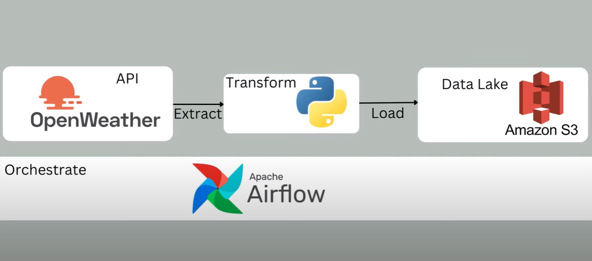

# 🌦️ Weather Data ETL Pipeline with Apache Airflow on AWS

This is a hands-on data engineering project where we build and automate an ETL (Extract, Transform, Load) pipeline to fetch current weather data from the **OpenWeatherMap API**, transform it, and load it into an **AWS S3 bucket** using **Apache Airflow**.

The entire project is carried out on the **AWS Cloud Platform** and introduces key Airflow concepts such as **DAGs**, **Operators**, and **Sensors**.

## Project Architecture

 

## Project Objectives

- Extract real-time weather data from OpenWeatherMap API
- Transform the data into a structured format (e.g., JSON or CSV)
- Load the processed data into an AWS S3 bucket
- Automate the ETL process using Apache Airflow
- Schedule and monitor the pipeline using Airflow DAGs
- Deploy everything on AWS

## Tech Stack

- **Apache Airflow** – Workflow orchestration
- **Python** – Data extraction and transformation
- **AWS S3** – Cloud storage
- **OpenWeatherMap API** – Data source
- **Docker** *(optional)* – For local Airflow environment
- **AWS EC2 / MWAA** – Deployment options

